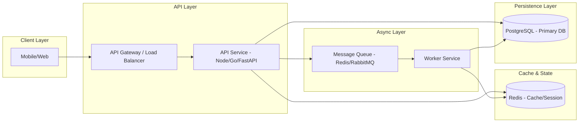

# Backend Architecture Pattern: API + Worker + Redis
 

 
### Key Patterns Applied:
- **Cache-Aside Pattern**: API checks Redis before querying Postgres.
- **Transactional Outbox**: Worker handles slow side-effects (emails, image processing) asynchronously.
- **Resource-Based API**: Structured REST/GraphQL endpoints.
- **Stateless Auth**: JWT validation with Redis-backed revocation list.
