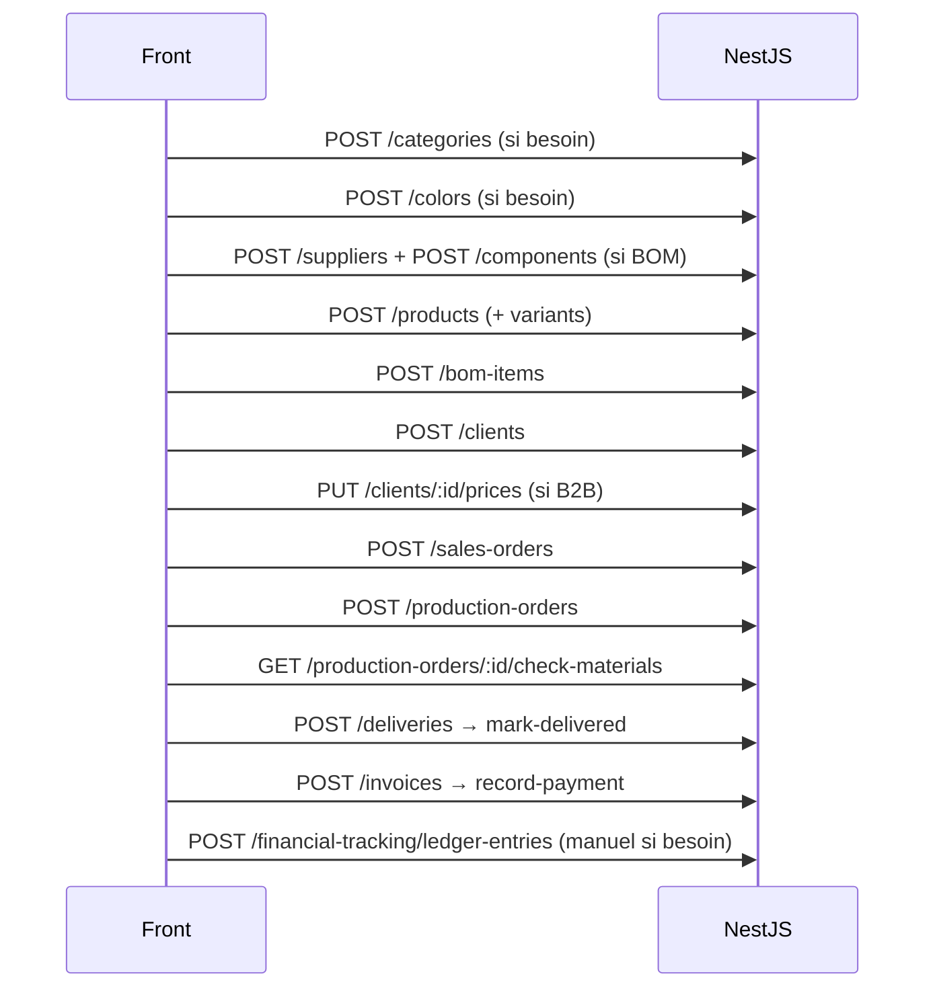

# Chaîne métier bout-en-bout (Front)

Vue transverse : ordre des écrans / appels pour un parcours client classique.  
Détail par domaine dans les fiches dédiées de ce dossier.

## Scénario nominal — commande catalogue

## Scénario modèle privé client

1. `POST /clients`  
2. `POST /sales-orders` avec ligne `newProduct` **ou** `POST /products` `ownership=CLIENT` puis commande avec `productId`  
3. Suite identique : OF → livraison → facture  

## Règles d’intégration Front (Orchestrateur)

1. **Source de vérité** : DTOs Nest + enums Prisma (régénérer clients OpenAPI si le front les utilise).  
2. **Zéro `any`** : mapper chaque payload create sur le type généré / partagé.  
3. **Ne pas inventer de champs** : ex. `tag` image produit non persisté.  
4. **Ne pas muter le stock trop tôt** :  
   - pas à la création produit / commande / OF  
   - stock composant ↑ à `mark-received` achat  
5. **Ownership** : partage catalogue = COMPANY only ; modèle CLIENT hors catalogue.  
6. **Références documentaires** : préfixes `CMD`, `OF`, `ACH`, `LIV`, `PRO/ACO/INT/FAC/AVO` — afficher mais laisser le back générer sauf override expert.  
7. **Droits** : toutes les créations = Admin (`GERANT` ou `isAdmin`). Prévoir 403 UI.  
8. **Cohérence client livraison** : le back n’impose pas `delivery.clientId === salesOrder.clientId` — le front doit verrouiller.

## Matrice dépendances create

| Je crée… | J’ai besoin avant de… |
|----------|------------------------|
| Produit | Catégorie (± couleur, ± client si CLIENT) |
| BOM | Produit + composant (± couleur, ± variante) |
| Composant PURCHASED | Fournisseur |
| Commande vente | Client (± produit/variante/prix B2B) |
| OF | Produit (± commande) |
| Achat | Fournisseur (± composant) |
| Livraison | Commande vente + client |
| Facture | Client (± commande) |
| Catalog share | Produits COMPANY |
| Écriture ledger | (optionnel) catégories / docs liés |
| User | Un admin déjà connecté |

## MVP Front recommandé (par vague)

| Vague | Flows |
|-------|-------|
| V1 | Référentiels, produits, clients, utilisateurs |
| V2 | Commandes vente, OF, livraisons, factures |
| V3 | Composants, BOM, achats, finance, partage catalogue |

## Definition of Done (intégration)

- [ ] Chaque formulaire create appelle exactement les endpoints documentés  
- [ ] Enums UI = enums API (pas de labels hardcodés divergents)  
- [ ] Empty states + 403 + erreurs validation couverts  
- [ ] Types front régénérés après changement DTO (`generate:api` si applicable)  
- [ ] Scénario nominal manuel OK (produit → commande → OF → livraison → facture)
