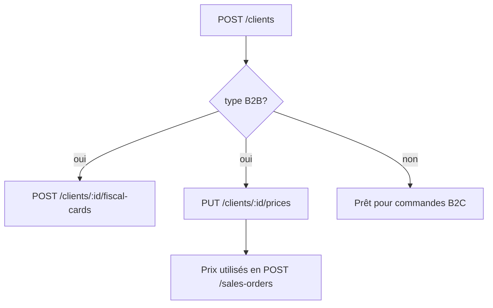

# Flow — Création d’un client

## 1. Analyse produit & enjeux

Le client porte B2B/B2C, la facturation, les prix négociés et éventuellement des modèles privés (`ProductOwnership.CLIENT`). La qualité des données légales conditionne les ventes et factures.

## 2. User stories

**US-CLI-01**  
En tant qu’admin, je veux créer un client B2C ou B2B, afin de passer des commandes et émettre des factures.

**US-CLI-02**  
En tant qu’admin, je veux uploader la carte fiscale d’un B2B, afin de sécuriser la conformité.

**US-CLI-03**  
En tant qu’admin, je veux saisir des prix HT négociés par variante pour un B2B, afin d’automatiser le pricing commande.

## 3. Critères d’acceptation

```gherkin
Étant donné un admin
Quand il crée un client type B2C avec name
Alors le client est créé (legalForm défaut INDIVIDUAL, status ACTIVE)

Étant donné legalForm=COMPANY
Quand nif, stat, contactName, email ou phone manquent
Alors la création est refusée

Étant donné un client B2B
Quand j’uploade une carte fiscale (png/jpeg/webp) avec validUntil
Alors le document est stocké et listable

Étant donné un client B2C
Quand j’essaie d’uploader une carte fiscale
Alors l’opération est refusée (B2B uniquement)
```

## 4. Flow API



### Ordre recommandé

```
POST /clients
POST /clients/:id/fiscal-cards     # B2B, optionnel
PUT  /clients/:id/prices           # B2B, si tarifs négociés
GET  /clients/:id
```

### Endpoints

| Méthode | Path | Auth | Notes |
|---------|------|------|-------|
| `POST` | `/clients` | JWT + Admin | création |
| `POST` | `/clients/:id/fiscal-cards` | JWT + Admin | multipart + `validUntil` |
| `POST` | `/clients/:id/fiscal-cards/:cardId/replace` | JWT + Admin | nouvelle version |
| `PUT` | `/clients/:id/prices` | JWT + Admin | upsert prix B2B |
| `GET` | `/clients/:id/prices` | JWT | liste |
| `GET` | `/clients/:id/prices/resolve` | JWT | résolution prix |

## 5. Types / enums

| Enum | Valeurs |
|------|---------|
| `ClientType` | `B2B`, `B2C` |
| `ClientLegalForm` | `INDIVIDUAL`, `COMPANY` |
| `ClientStatus` | `ACTIVE`, `PROSPECT`, `LOYAL`, `INACTIVE` |

## 6. Brief UI/UX

- Formulaire dynamique : si `COMPANY`, afficher blocs NIF / STAT / contact / email / phone obligatoires.  
- Toggle B2B/B2C en tête — change les étapes suivantes (carte fiscale, prix).  
- Empty prices B2B : CTA « Ajouter un tarif variante ».  
- Empty fiscal cards : CTA « Téléverser la carte fiscale ».  
- Formats carte : png, jpeg, webp ≤ 10 Mo.

## 7. Brief API

### `POST /clients` — CreateClientDto

| Champ | Obligatoire | Notes |
|-------|-------------|-------|
| `name` | oui | |
| `type` | oui | `B2B` \| `B2C` |
| `legalForm` | non | défaut `INDIVIDUAL` |
| `status` | non | défaut `ACTIVE` |
| `email`, `phone`, `contactName`, `nif`, `stat` | si COMPANY | tous requis ensemble |
| `siret`, `addressLine`, `city`, `postalCode`, `country` | non | |

### Carte fiscale

- Body multipart : `file` + `validUntil` (date string, requis) + `note?`.

### Prix B2B — UpsertClientVariantPricesDto

```json
{
  "prices": [
    {
      "productId": "...",
      "variantId": "...",
      "agreedPriceHt": 85.0,
      "notes": "Tarif volume 2026"
    }
  ]
}
```

Contraintes : au moins 1 prix ; variante doit appartenir au produit ; client B2B.

## 8. Edge cases

| Cas | Comportement |
|-----|--------------|
| COMPANY incomplet | BadRequest |
| Prix sur B2C | refusé |
| variante ≠ productId | BadRequest |
| MIME fichier invalide | rejeté multer |

## 9. MVP vs Post-MVP

| MVP | Post-MVP |
|-----|----------|
| Create client + type | Scoring fidélité auto, multi-contacts |
| Prix B2B + carte fiscale | OCR carte fiscale |
