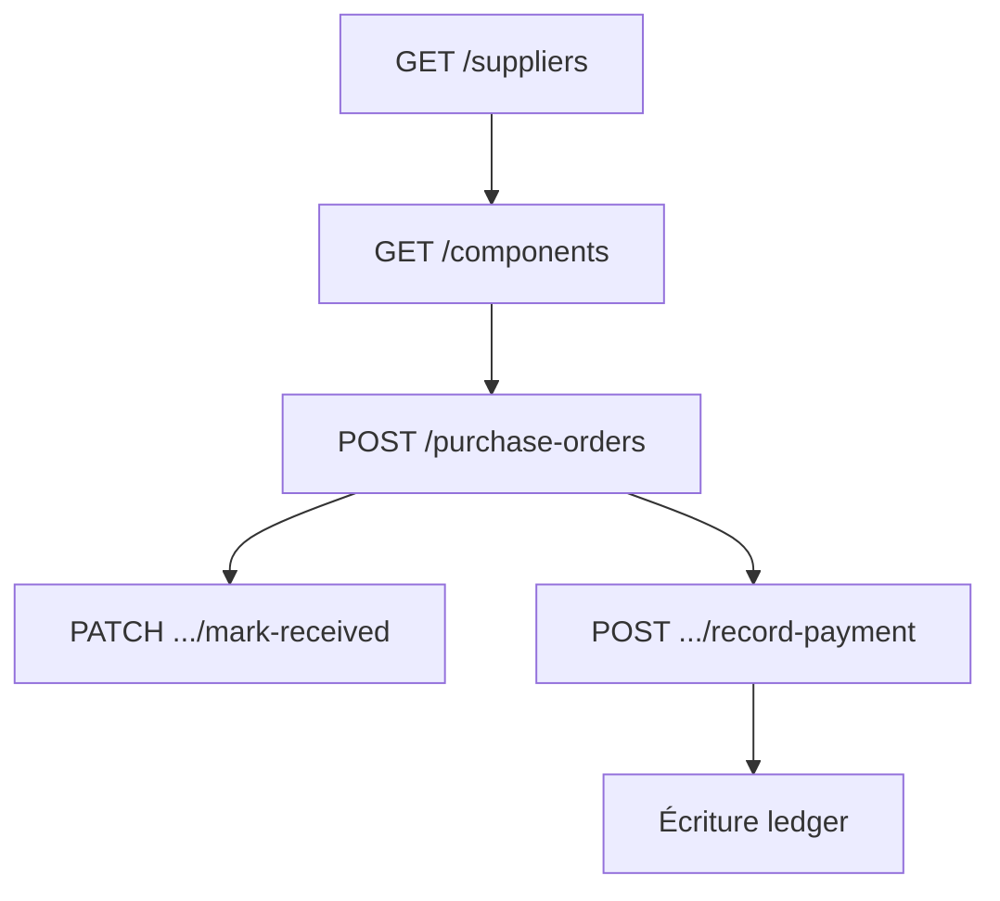

# Flow — Commande d’achat (purchase order)

## 1. Analyse produit & enjeux

L’achat réapprovisionne les composants. La création reste en `DRAFT` ; le stock n’augmente qu’à la réception (`mark-received`). Les paiements fournisseurs alimentent le ledger.

## 2. User stories

**US-PO-01**  
En tant que responsable stocks, je veux créer une commande d’achat avec lignes composants, afin de commander chez un fournisseur.

**US-PO-02**  
En tant que responsable stocks, je veux marquer une réception, afin de mettre à jour le stock composants.

**US-PO-03**  
En tant que responsable financier, je veux enregistrer un paiement fournisseur, afin de suivre la trésorerie.

## 3. Critères d’acceptation

```gherkin
Étant donné un supplierId et items non vides
Quand je crée un achat
Alors orderNumber = ACH/{NNNNNN}, status=DRAFT, paidAmount=0
Et totalHt = Σ quantity × unitPrice

Étant donné une commande avec componentId sur les lignes
Quand je marque reçue
Alors stockQty de chaque composant est incrémenté de quantity

Étant donné items = []
Quand je crée
Alors la validation échoue (items required + IsArray ; service attend des lignes)
```

## 4. Flow API



### Ordre recommandé

```
GET  /suppliers
GET  /components
POST /purchase-orders
PATCH /purchase-orders/:id           # confirmer / transit si besoin
PATCH /purchase-orders/:id/mark-received
POST  /purchase-orders/:id/record-payment
```

### Endpoints

| Méthode | Path | Auth |
|---------|------|------|
| `POST` | `/purchase-orders` | JWT + Admin |
| `PATCH` | `/purchase-orders/:id/mark-received` | JWT + Admin |
| `POST` | `/purchase-orders/:id/record-payment` | JWT + Admin |

## 5. Types / enums

| Enum | Valeurs |
|------|---------|
| `PurchaseOrderStatus` | `DRAFT`, `CONFIRMED`, `IN_TRANSIT`, `PARTIALLY_RECEIVED`, `RECEIVED`, `CANCELLED` |
| `PaymentMethod` (paiement) | `CASH`, `BANK_TRANSFER`, `CHECK`, `MOBILE_MONEY`, `CARD` |

Préfixe : `ACH/{6 digits}`.

## 6. Brief UI/UX

- Form : fournisseur, date, échéance, devise, notes + table lignes.  
- Ligne : description obligatoire ; `componentId` optionnel mais recommandé pour le stock.  
- Empty state liste : CTA « Nouvel achat ».  
- Bouton réception : confirmation « Ceci augmente le stock ».  
- Pas d’audit / notif à la création (prévoir feedback UI seulement).

## 7. Brief API

### CreatePurchaseOrderDto

| Champ | Obligatoire | Notes |
|-------|-------------|-------|
| `supplierId` | oui | FK |
| `orderDate` | oui | ISO |
| `items` | oui | tableau |
| `orderNumber` | non | auto `ACH/...` |
| `expectedAt` | non | |
| `status` | non | défaut `DRAFT` |
| `currency` | non | `EUR` |
| `notes` | non | |

### CreatePurchaseOrderItemDto

| Champ | Obligatoire | Notes |
|-------|-------------|-------|
| `description` | oui | |
| `quantity` | oui | ≥ 0 |
| `unitPrice` | oui | ≥ 0 |
| `componentId` | non | requis pour stock à réception |

## 8. Edge cases

| Cas | Comportement |
|-----|--------------|
| supplierId invalide | erreur Prisma |
| Ligne sans componentId | OK à create ; **pas** d’incrément stock à réception |
| Double mark-received | à gérer en statut UI (évite double stock) |

## 9. MVP vs Post-MVP

| MVP | Post-MVP |
|-----|----------|
| Create + réception + paiement | Réception partielle ligne à ligne, BL fournisseur |
