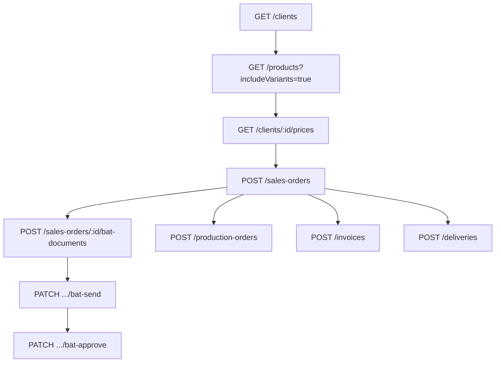

# Flow — Commande de vente (sales order)

## 1. Analyse produit & enjeux

La commande client déclenche production, livraison et facturation. Elle gère B2B/B2C, pricing catalogue ou négocié, modèles privés créés à la volée, et le cycle BAT.

## 2. User stories

**US-SO-01**  
En tant qu’admin commercial, je veux créer une commande avec lignes produit, afin d’enregistrer la demande client.

**US-SO-02**  
En tant qu’admin, je veux créer une ligne avec `newProduct` pour un modèle client, afin d’éviter un passage catalogue COMPANY.

**US-SO-03**  
En tant qu’admin, je veux gérer le BAT (upload / envoi / approbation), afin de valider le modèle avant production.

## 3. Critères d’acceptation

```gherkin
Étant donné un client existant
Quand je crée une commande avec orderDate et sans orderNumber
Alors orderNumber = CMD/{NNNNNN}, status=TO_PROCESS, currency=EUR, taxRate=20

Étant donné orderType forcé différent du type client
Quand je crée
Alors BadRequest

Étant donné une ligne B2B sans unitPriceHt et sans prix négocié variante
Quand je crée
Alors BadRequest (prix impossible à résoudre)

Étant donné productId et newProduct ensemble sur une ligne
Quand je crée
Alors BadRequest (XOR)
```

## 4. Flow API



### Ordre recommandé

```
GET  /clients
GET  /products?includeVariants=true
GET  /clients/:id/prices              # B2B
GET  /categories                      # si newProduct
POST /sales-orders
POST /sales-orders/:id/bat-documents  # si batRequired
PATCH /sales-orders/:id/status
```

### Endpoints create / enrichissement

| Méthode | Path | Auth |
|---------|------|------|
| `POST` | `/sales-orders` | JWT + Admin |
| `POST` | `/sales-orders/:id/bat-documents` | JWT + Admin |
| `POST` | `/sales-orders/:id/bat-documents/:documentId/replace` | JWT + Admin |
| `PATCH` | `/sales-orders/:id/status` | JWT + Admin |
| `PATCH` | `/sales-orders/:id/bat-send` | JWT + Admin |
| `PATCH` | `/sales-orders/:id/bat-approve` | JWT + Admin |

## 5. Types / enums

| Enum | Valeurs |
|------|---------|
| `SalesOrderStatus` | `QUOTE`, `TO_PROCESS`, `IN_PRODUCTION`, `PREPARING`, `SHIPPED`, `DELIVERED`, `INVOICED`, `CANCELLED` |
| `ClientType` (orderType) | `B2B`, `B2C` |
| `BatDocumentKind` | `PREVIEW`, `SENT_TO_CLIENT`, `APPROVED_SIGNED`, `OTHER` |

Préfixe référence : `CMD/{6 digits}`.

## 6. Brief UI/UX

- En-tête : client (fixe le type B2B/B2C), date, TVA, devise, BAT requis.  
- Lignes : choix produit existant **ou** « Nouveau modèle client » (`newProduct`).  
- B2B : afficher prix négocié résolu ; sinon imposer saisie manuelle `unitPriceHt`.  
- B2C : prix catalogue = `variant.priceOverride ?? product.basePrice`.  
- Empty items : autorisé (`items: []`) mais warning UX « commande sans lignes ».  
- Pas de mouvement de stock à la création.

## 7. Brief API

### CreateSalesOrderDto

| Champ | Obligatoire | Défaut / notes |
|-------|-------------|----------------|
| `clientId` | oui | |
| `orderDate` | oui | ISO date |
| `orderNumber` | non | auto `CMD/...` |
| `orderType` | non | = `client.type` |
| `status` | non | `TO_PROCESS` |
| `taxRate` | non | `20` |
| `currency` | non | `EUR` |
| `items` | non | `[]` |
| `notes` | non | |
| `batRequired` | non | `false` |

### CreateSalesOrderItemDto

| Champ | Obligatoire | Notes |
|-------|-------------|-------|
| `description` | oui | |
| `quantity` | oui | int ≥ 1 |
| `unitPriceHt` | non | résolu si omis |
| `taxRate` | non | fallback order |
| `productId` | non | XOR `newProduct` |
| `variantId` | non | |
| `newProduct` | non | crée produit `ownership=CLIENT` |

### CreateOrderClientProductDto (= CreateProductDto sans ownership/ownerClientId)

`name`, `categoryId`, `basePrice` requis ; `ref`, `variants`, etc. optionnels.

### Pricing (à reproduire côté UI)

1. Si `unitPriceHt` fourni → utilisé.  
2. Sinon besoin `productId` et/ou `variantId`.  
3. **B2C** : catalogue variante/produit.  
4. **B2B** : `clientVariantPrice` ou saisie manuelle obligatoire.

Side effects create : totaux HT/TTC, audit `SALES_ORDER_CREATED`, notifications rôles (gérant, resp. général, financier/stocks).

## 8. Edge cases

| Cas | Comportement |
|-----|--------------|
| Client introuvable | 404 |
| Produit CLIENT d’un autre client | refusé |
| Variante unique auto-assignée sur newProduct | OK |
| Transition status hors matrice | BadRequest (PATCH status) |

## 9. MVP vs Post-MVP

| MVP | Post-MVP |
|-----|----------|
| Create + lignes + pricing B2B/B2C | Devis QUOTE multi-étapes, e-sign BAT |
| BAT upload basique | Workflow notification client externe |
