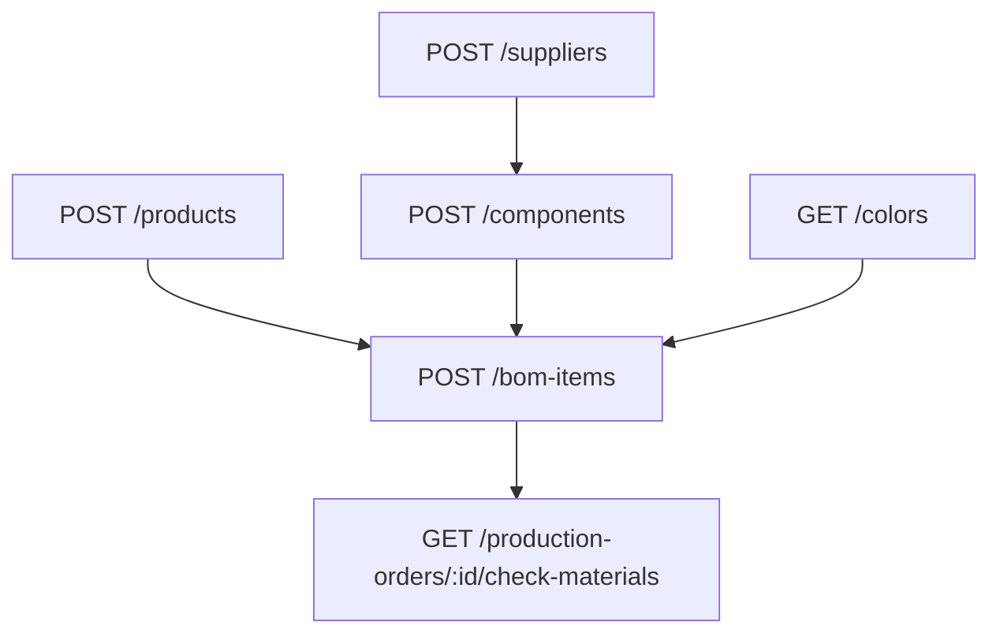

# Flow — Composants & nomenclature (BOM)

## 1. Analyse produit & enjeux

Les **composants** sont les matières / semi-finis. La **BOM** (`BomItem`) relie produit (± variante, ± couleur composant) à une quantité de composant. C’est la base du check matières en production.

## 2. User stories

**US-CMP-01**  
En tant qu’admin stocks, je veux créer un composant acheté ou fabriqué, afin de suivre le stock et le coût.

**US-BOM-01**  
En tant qu’admin atelier, je veux définir la nomenclature d’un produit, afin de prédire la consommation matière à l’OF.

## 3. Critères d’acceptation

```gherkin
Étant donné origin=PURCHASED sans supplierId
Quand je crée un composant
Alors l’API refuse (fournisseur requis)

Étant donné origin=MANUFACTURED
Quand je crée un composant sans supplierId
Alors la création réussit

Étant donné un productId et componentId valides
Quand je crée un BomItem avec quantity > 0
Alors la ligne de nomenclature est enregistrée

Étant donné un doublon (productId, variantId, componentId, colorId)
Quand je recrée la même ligne
Alors unicité Prisma échoue
```

## 4. Flow API



### Ordre recommandé

```
POST /suppliers                 # si PURCHASED
POST /components
POST /products                  # déjà créé
POST /bom-items                 # 1 appel par ligne
```

### Endpoints

| Méthode | Path | Auth |
|---------|------|------|
| `POST` | `/components` | JWT + Admin |
| `GET` | `/components` | JWT |
| `POST` | `/bom-items` | JWT + Admin |
| `GET` | `/bom-items` | JWT |

## 5. Types / enums

| Enum | Valeurs |
|------|---------|
| `MaterialUnit` | `KG`, `M2`, `M`, `PCS`, `BOBBIN` |
| `ComponentOrigin` | `PURCHASED`, `MANUFACTURED` |

## 6. Brief UI/UX

- Form composant : bascule Origine → si PURCHASED, select fournisseur obligatoire.  
- Écran BOM produit : table lignes + CTA « Ajouter matière ».  
- Empty BOM : warning « Nomenclature vide — le check matières OF sera trivial / non fiable ».  
- Afficher unité du composant en lecture seule sur la ligne BOM.

## 7. Brief API

### CreateComponentDto

| Champ | Obligatoire | Notes |
|-------|-------------|-------|
| `ref` | oui | unique |
| `name` | oui | |
| `unit` | oui | MaterialUnit |
| `stockQty` | oui | ≥ 0 |
| `minQty` | oui | ≥ 0 |
| `costPerUnit` | non | ≥ 0 |
| `origin` | non | défaut `PURCHASED` |
| `supplierId` | si PURCHASED | |

### CreateBomItemDto

| Champ | Obligatoire | Notes |
|-------|-------------|-------|
| `productId` | oui | |
| `componentId` | oui | |
| `quantity` | oui | ≥ 0 |
| `variantId` | non | BOM spécifique variante |
| `colorId` | non | couleur du composant |
| `unitCost` | non | snapshot coût |

## 8. Edge cases

| Cas | Comportement |
|-----|--------------|
| FK produit/composant invalide | erreur Prisma |
| Ref composant dupliquée | conflit |
| Stock non muté à la création BOM | normal — stock bougera à la réception achat / conso production |

## 9. MVP vs Post-MVP

| MVP | Post-MVP |
|-----|----------|
| Create composant + lignes BOM | Éditeur BOM par taille, explosion multi-niveaux |
