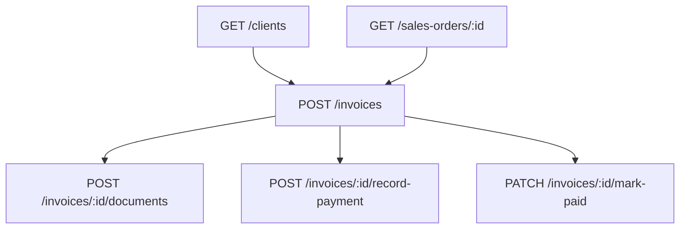

# Flow — Factures

## 1. Analyse produit & enjeux

Les factures (proforma, acompte, intermédiaire, finale, avoir) matérialisent le cycle commercial. Le numéro est **typé** par préfixe. Le statut create par défaut est `ISSUED` (pas `DRAFT`).

## 2. User stories

**US-INV-01**  
En tant que responsable financier, je veux créer une facture liée à une commande, afin de facturer le client.

**US-INV-02**  
En tant qu’admin, je veux uploader le PDF signé / tamponné, afin d’archiver la pièce GED.

**US-INV-03**  
En tant que responsable financier, je veux enregistrer un paiement, afin de suivre l’encours.

## 3. Critères d’acceptation

```gherkin
Étant donné type=PROFORMA et clientId
Quand je crée sans invoiceNumber
Alors invoiceNumber = PRO/{NNNNNN}, status=ISSUED
Et une notification proforma_ready part vers RESPONSABLE_GENERAL

Étant donné type=FINAL
Quand je crée
Alors le préfixe est FAC/

Étant donné salesOrderId
Quand je crée
Alors referenceLevel est aligné sur la commande
```

## 4. Flow API



### Ordre recommandé

```
GET  /sales-orders/:id
GET  /clients/:id
POST /invoices
POST /invoices/:id/documents
POST /invoices/:id/record-payment
# ou
PATCH /invoices/:id/mark-paid
```

### Endpoints

| Méthode | Path | Auth |
|---------|------|------|
| `POST` | `/invoices` | JWT + Admin |
| `POST` | `/invoices/:id/documents` | JWT + Admin |
| `POST` | `/invoices/:id/documents/:documentId/replace` | JWT + Admin |
| `POST` | `/invoices/:id/record-payment` | JWT + Admin |
| `PATCH` | `/invoices/:id/mark-paid` | JWT + Admin |
| `PUT` | `/invoices/templates/:type` | JWT + Admin |

## 5. Types / enums

| Enum | Valeurs |
|------|---------|
| `InvoiceType` | `PROFORMA`, `DEPOSIT`, `INTERMEDIATE`, `FINAL`, `CREDIT_NOTE` |
| `InvoiceStatus` | `DRAFT`, `ISSUED`, `SENT`, `PAID`, `PARTIALLY_PAID`, `OVERDUE`, `CANCELLED` |
| `InvoiceDocumentKind` | `SIGNED`, `STAMPED`, `SIGNED_AND_STAMPED`, `OTHER` |
| `PaymentMethod` | `CASH`, `BANK_TRANSFER`, `CHECK`, `MOBILE_MONEY`, `CARD` |

### Préfixes auto

| Type | Préfixe |
|------|---------|
| PROFORMA | `PRO` |
| DEPOSIT | `ACO` |
| INTERMEDIATE | `INT` |
| FINAL | `FAC` |
| CREDIT_NOTE | `AVO` |

## 6. Brief UI/UX

- Select type facture en premier (change libellés + préfixe).  
- Préremplir lignes depuis commande si `salesOrderId`.  
- Empty items autorisé mais warning.  
- Zone documents : upload PDF/image signé.  
- Badge status : défaut après create = **ISSUED** (ne pas afficher like draft).  
- Totaux : `subtotalHt` + TVA ligne (`taxRate` défaut 20) → `totalTtc` — afficher en live côté UI.

## 7. Brief API — CreateInvoiceDto

| Champ | Obligatoire | Notes |
|-------|-------------|-------|
| `type` | oui | InvoiceType |
| `clientId` | oui | |
| `issueDate` | oui | ISO |
| `invoiceNumber` | non | auto selon type |
| `status` | non | défaut **`ISSUED`** |
| `salesOrderId` | non | aligne ref level |
| `dueDate` | non | |
| `items` | non | `[]` |
| `currency` | non | `EUR` |
| `notes` | non | |

### CreateInvoiceItemDto

| Champ | Obligatoire | Notes |
|-------|-------------|-------|
| `description` | oui | |
| `quantity` | oui | int ≥ 1 |
| `unitPriceHt` | oui | ≥ 0 |
| `taxRate` | non | défaut 20 |
| `salesOrderItemId`, `productId`, `variantId` | non | |

Side effects : audit `INVOICE_CREATED` ; notif si PROFORMA ; **pas** de changement auto status sales-order ni stock.

## 8. Edge cases

| Cas | Comportement |
|-----|--------------|
| Numéro manuel mauvais préfixe / mauvais niveau | BadRequest |
| salesOrderId inexistant | erreur |
| Type CREDIT_NOTE | montants gérés comme les autres (UI doit clarifier le sens) |

## 9. MVP vs Post-MVP

| MVP | Post-MVP |
|-----|----------|
| Create typée + paiement + document | Envoi email template, PDF généré serveur |
