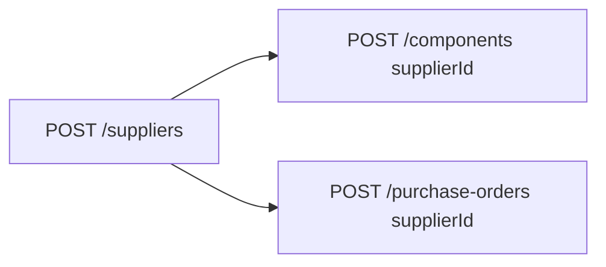

# Flow — Fournisseurs

## 1. Analyse produit & enjeux

Le fournisseur alimente les composants `PURCHASED` et les commandes d’achat. Sans lui, impossible de tracer stock entrée et coûts matière.

## 2. User stories

**US-SUP-01**  
En tant qu’admin stocks, je veux créer un fournisseur, afin de lier composants et bons d’achat.

## 3. Critères d’acceptation

```gherkin
Étant donné un admin
Quand il crée un fournisseur avec name unique
Alors le fournisseur est créé et utilisable dans POST /components et POST /purchase-orders

Étant donné un name déjà pris
Quand il recrée le même name
Alors une erreur d’unicité est renvoyée
```

## 4. Flow API



### Endpoints

| Méthode | Path | Auth |
|---------|------|------|
| `GET` | `/suppliers` | JWT |
| `GET` | `/suppliers/:id` | JWT |
| `POST` | `/suppliers` | JWT + Admin |

## 5. Types / enums

Aucun enum dédié.

## 6. Brief UI/UX

- Formulaire simple : nom (unique) + contact + lead time + note qualité.  
- Empty state : « Aucun fournisseur — en créer un avant les composants achetés ».  
- Afficher `qualityRating` sur 5 avec contrainte 1 décimale max.

## 7. Brief API — CreateSupplierDto

| Champ | Obligatoire | Contraintes |
|-------|-------------|-------------|
| `name` | oui | unique Prisma |
| `country`, `category`, `phone` | non | |
| `email` | non | format email |
| `leadTimeDays` | non | number |
| `qualityRating` | non | 0–5, max 1 décimale |

## 8. MVP vs Post-MVP

| MVP | Post-MVP |
|-----|----------|
| CRUD fournisseur | Scoring auto, documents fournisseur |
