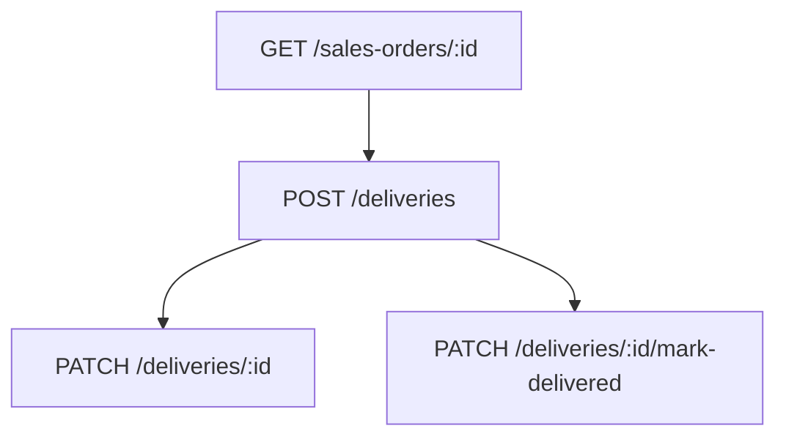

# Flow — Livraisons

## 1. Analyse produit & enjeux

La livraison suit l’expédition d’une commande. Elle partage le niveau de référence (`LIV/{NNNNNN}`) avec la sales order. Le marquage « delivered » peut passer la commande en `DELIVERED` et notifier.

## 2. User stories

**US-DEL-01**  
En tant que responsable livraison, je veux créer une livraison liée à une commande, afin de tracer transporteur et tracking.

**US-DEL-02**  
En tant que responsable livraison, je veux marquer livré, afin de clôturer le flux logistique commande.

## 3. Critères d’acceptation

```gherkin
Étant donné salesOrderId et clientId
Quand je crée une livraison sans numéro
Alors deliveryNumber = LIV/{level de la commande}, status=PLANNED

Étant donné un numéro manuel dont le niveau ≠ commande
Quand je crée
Alors BadRequest

Étant donné une livraison
Quand je marque delivered
Alors le back tente sales-order → DELIVERED + notifications
```

## 4. Flow API



### Ordre recommandé

```
GET  /sales-orders/:id
POST /deliveries                    # clientId = SO.clientId
PATCH /deliveries/:id               # carrier / tracking / status
PATCH /deliveries/:id/mark-delivered
```

### Endpoints

| Méthode | Path | Auth |
|---------|------|------|
| `POST` | `/deliveries` | JWT + Admin |
| `PATCH` | `/deliveries/:id/mark-delivered` | JWT + Admin |

## 5. Types / enums

| Enum | Valeurs |
|------|---------|
| `DeliveryStatus` | `PLANNED`, `PREPARING`, `IN_TRANSIT`, `DELIVERED`, `FAILED`, `RETURNED` |

Préfixe : `LIV/{6 digits}`.

## 6. Brief UI/UX

- Préremplir `clientId` depuis la commande (le back **ne vérifie pas** l’égalité SO.clientId — le front doit l’assurer).  
- Champs transporteur / tracking / ETA optionnels.  
- Empty liste : « Aucune livraison pour cette commande — planifier ».  
- Pas d’audit / notif à la **création** (seulement au mark-delivered).  
- Confirmation avant mark-delivered.

## 7. Brief API — CreateDeliveryDto

| Champ | Obligatoire | Notes |
|-------|-------------|-------|
| `salesOrderId` | oui | commande existante |
| `clientId` | oui | idéalement = SO.clientId |
| `deliveryNumber` | non | auto `LIV/...` |
| `carrier`, `trackingCode` | non | |
| `eta` | non | ISO |
| `status` | non | défaut `PLANNED` |
| `notes` | non | |

Pas de lignes (pas d’items).

## 8. Edge cases

| Cas | Comportement |
|-----|--------------|
| salesOrderId inexistant | erreur |
| clientId ≠ SO.clientId | **accepté** côté API — bug UX si front ne verrouille pas |
| Update SO DELIVERED échoue | erreur avalée sur mark-delivered |

## 9. MVP vs Post-MVP

| MVP | Post-MVP |
|-----|----------|
| Create + mark-delivered | Multi-colis, preuve de livraison photo |
