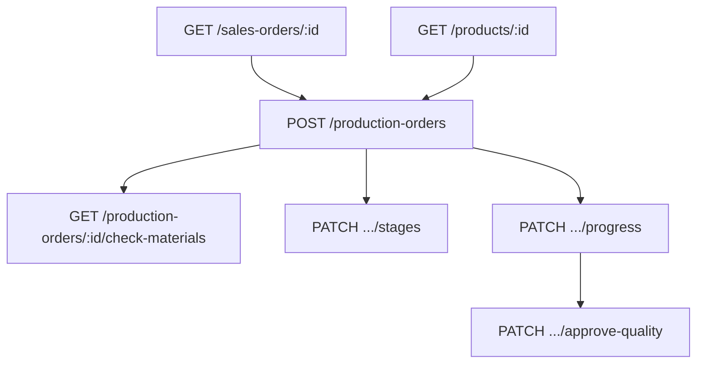

# Flow — Ordre de production (OF)

## 1. Analyse produit & enjeux

L’OF planifie la fabrication d’une quantité d’un produit (± variante), souvent issu d’une commande. Il crée automatiquement les 6 étapes atelier et peut basculer la commande en `IN_PRODUCTION`.

## 2. User stories

**US-OF-01**  
En tant que responsable production, je veux créer un OF lié à une commande, afin de lancer l’atelier.

**US-OF-02**  
En tant que responsable production, je veux vérifier les matières (BOM × qty vs stock) avant d’avancer, afin d’éviter les ruptures.

## 3. Critères d’acceptation

```gherkin
Étant donné un productId valide et quantity ≥ 1
Quand je crée un OF sans orderNumber
Alors orderNumber = OF/{NNNNNN}, status=PLANNED, progress=0
Et 6 ProductionStep sont créés (PREPARATION → … → QUALITY_CONTROL)

Étant donné salesOrderId renseigné
Quand la création réussit
Alors le back tente de passer la commande en IN_PRODUCTION

Étant donné startDate et endDate valides (end > start)
Quand je crée
Alors les fenêtres plannedStart/End des étapes sont réparties uniformément
```

## 4. Flow API



### Ordre recommandé

```
GET  /sales-orders/:id            # si lié
GET  /products/:id                # variantes + BOM
POST /production-orders
GET  /production-orders/:id/check-materials
PATCH /production-orders/:id/stages
PATCH /production-orders/:id/progress
PATCH /production-orders/:id/approve-quality   # quand COMPLETED
```

### Endpoints

| Méthode | Path | Auth |
|---------|------|------|
| `POST` | `/production-orders` | JWT + Admin |
| `GET` | `/production-orders/:id/check-materials` | JWT |
| `PATCH` | `/production-orders/:id/stages` | JWT + Admin |
| `PATCH` | `/production-orders/:id/progress` | JWT + Admin |
| `PATCH` | `/production-orders/:id/approve-quality` | JWT + Admin |

## 5. Types / enums

| Enum | Valeurs |
|------|---------|
| `ProductionStatus` | `PLANNED`, `PREPARATION`, `IN_PROGRESS`, `COMPLETED`, `CANCELLED` |
| `ProductionStage` | `PREPARATION`, `CROCHET`, `WEAVING`, `LEATHER`, `FINISHING`, `QUALITY_CONTROL` |

Préfixe ref : `OF/{6 digits}` (partage `referenceLevel` avec la commande liée si présente).

## 6. Brief UI/UX

- Form create : produit, variante, quantité, lien commande optionnel, dates.  
- Après create : timeline des 6 étapes (non éditables à la création, via PATCH stages).  
- Bouton « Vérifier matières » → afficher manques stock.  
- Empty BOMs : alerte « Pas de nomenclature sur ce produit ».  
- Qualité : bouton actif seulement si status `COMPLETED`.  
- **Pas de conso stock à la création OF.**

## 7. Brief API — CreateProductionOrderDto

| Champ | Obligatoire | Notes |
|-------|-------------|-------|
| `productId` | oui | |
| `quantity` | oui | int ≥ 1 |
| `orderNumber` | non | auto `OF/...` |
| `variantId` | non | |
| `salesOrderId` | non | |
| `salesOrderItemId` | non | |
| `status` | non | défaut `PLANNED` |
| `startDate`, `endDate` | non | ISO |

Side effects : 6 steps auto, audit `PRODUCTION_ORDER_CREATED`, tentative update SO → `IN_PRODUCTION` (erreurs avalées), **pas de notification** à la création.

### Upsert stages (après)

Chaque stage : `stage` requis + dates optionnelles + `progress` 0–100.

## 8. Edge cases

| Cas | Comportement |
|-----|--------------|
| salesOrderId inexistant | erreur |
| Niveau ref manuel ≠ niveau commande liée | BadRequest |
| Approve qualité hors COMPLETED | BadRequest |

## 9. MVP vs Post-MVP

| MVP | Post-MVP |
|-----|----------|
| Create OF + check matières + progress | Planning Gantt, conso stock auto |
