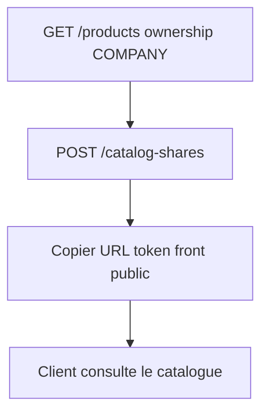

# Flow — Partage catalogue

## 1. Analyse produit & enjeux

Un **catalog share** génère un lien tokenisé pour montrer des produits **COMPANY** à un client (ou public ciblé), avec expiration et quota de vues optionnels.

## 2. User stories

**US-CAT-01**  
En tant qu’admin commercial, je veux créer un partage catalogue sur une sélection de produits, afin d’envoyer un lien au client.

## 3. Critères d’acceptation

```gherkin
Étant donné des productIds ownership=COMPANY
Quand je crée un catalog-share avec title ≥ 3 caractères
Alors un token UUID est généré, status=ACTIVE

Étant donné un productId ownership=CLIENT
Quand je l’inclus dans productIds
Alors l’API refuse (produits COMPANY uniquement)

Étant donné maxViewCount=10
Quand les vues atteignent la limite côté consumer
Alors le share n’est plus consultable (logique public/share)
```

## 4. Flow API



### Ordre recommandé

```
GET  /products?includeVariants=true   # filtrer COMPANY côté UI
GET  /clients                         # optionnel link client
POST /catalog-shares
# afficher / copier le token / URL front
```

### Endpoints

| Méthode | Path | Auth |
|---------|------|------|
| `POST` | `/catalog-shares` | JWT + Admin |
| `GET` | `/catalog-shares` | JWT (admin routes) |

*(Les endpoints publics de consommation via token peuvent exister hors de ce controller — vérifier le module catalog / auth publique côté front.)*

## 5. Types / enums

| Enum | Valeurs |
|------|---------|
| `CatalogShareStatus` | `ACTIVE`, `EXPIRED`, `REVOKED` |

## 6. Brief UI/UX

- Multi-select produits catalogue seulement (exclure CLIENT).  
- Title min 3 chars.  
- Options : expiration, max vues, client lié.  
- Après create : écran succès avec token + bouton copier lien.  
- Empty productIds : share vide possible — warning « aucun produit sélectionné ».

## 7. Brief API — CreateCatalogShareDto

| Champ | Obligatoire | Notes |
|-------|-------------|-------|
| `title` | oui | minLength 3 |
| `clientId` | non | |
| `productIds` | non | dédupliqués ; COMPANY only |
| `expiresAt` | non | ISO |
| `maxViewCount` | non | int ≥ 1 ; null = illimité |
| `status` | non | défaut `ACTIVE` |

Side effect : `token` UUID généré serveur.

## 8. Edge cases

| Cas | Comportement |
|-----|--------------|
| Produit introuvable ou CLIENT | BadRequest / assert |
| Doublons productIds | dédupliqués silencieusement |

## 9. MVP vs Post-MVP

| MVP | Post-MVP |
|-----|----------|
| Create share + copie lien | Analytics vues, branding client |
