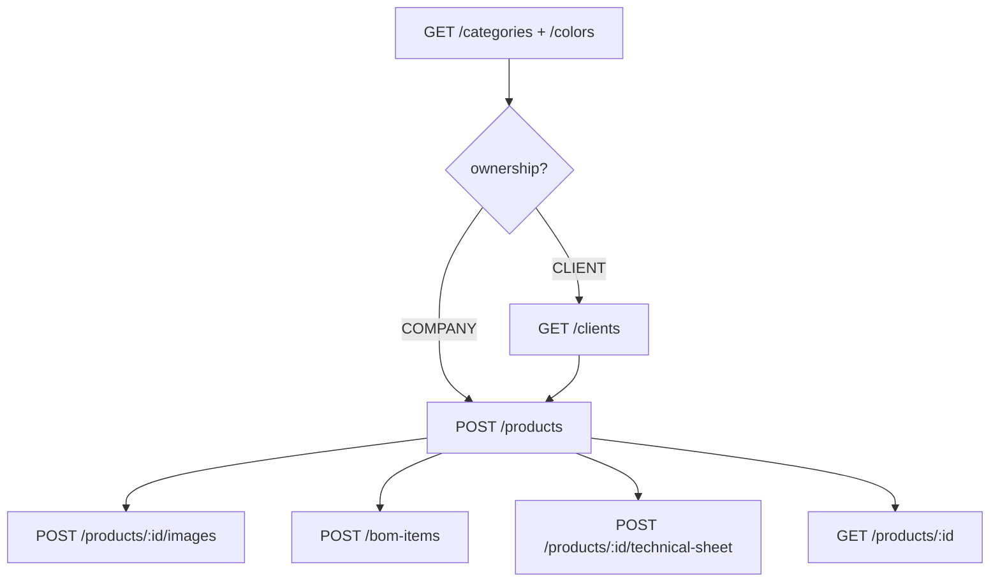

# Flow — Création d’un produit

## 1. Analyse produit & enjeux

Le produit est le cœur du catalogue. Il porte le prix de base, les variantes (taille / couleur), la nomenclature (BOM), les images et la fiche technique atelier. Deux natures : **COMPANY** (catalogue) et **CLIENT** (modèle privé).

## 2. User stories

**US-PRD-01**  
En tant qu’admin, je veux créer un produit catalogue avec variantes PM/MM/GM, afin de le vendre et le produire.

**US-PRD-02**  
En tant qu’admin, je veux créer un modèle privé lié à un client, afin de le commander hors catalogue.

**US-PRD-03**  
En tant qu’admin, je veux ajouter images, BOM et fiche technique après création, afin de préparer l’atelier.

## 3. Critères d’acceptation

```gherkin
Étant donné une catégorie existante
Quand j’envoie POST /products avec name, categoryId, basePrice
Alors le produit est créé en ownership=COMPANY, status=ACTIVE
Et si ref est absente, elle est générée depuis la catégorie (ex. S/000001)

Étant donné ownership=CLIENT sans ownerClientId
Quand je crée le produit
Alors l’API refuse (incohérence ownership)

Étant donné un produit créé
Quand j’uploade des images png/jpeg/webp ≤ 10 Mo
Alors elles sont compressées et listables via GET /products/:id/images
```

## 4. Flow API



### Ordre recommandé (happy path catalogue)

```
GET  /categories
GET  /colors
GET  /clients                    # si ownership CLIENT
POST /components                 # si BOM prévu
POST /products                   # + variants[]
POST /products/:id/images
POST /bom-items                  # N fois
POST /products/:id/technical-sheet
GET  /products/:id
```

### Endpoints

| Méthode | Path | Auth | Notes |
|---------|------|------|-------|
| `POST` | `/products` | JWT + Admin | création |
| `POST` | `/products/:id/images` | JWT + Admin | multipart `files` (max 10) |
| `GET` | `/products/:id/images` | JWT | liste |
| `POST` | `/products/:id/images/:imageId/replace` | JWT + Admin | |
| `DELETE` | `/products/:id/images/:imageId` | JWT + Admin | |
| `POST` | `/products/:id/technical-sheet` | JWT + Admin | upsert |
| `GET` | `/products/:id/technical-sheet` | JWT | |
| `GET` | `/products/:id` | JWT | détail + variantes |

## 5. Types / enums

| Enum | Valeurs |
|------|---------|
| `ProductOwnership` | `COMPANY`, `CLIENT` |
| `ProductStatus` | `ACTIVE`, `LOW_STOCK`, `OUT_OF_STOCK`, `ARCHIVED` |
| `ProductSize` | `PM`, `MM`, `GM` |
| `ProductTechnicalElementCategory` | `CROCHET`, `RAPHIA`, `LEATHER`, `ACCESSORY`, `LINING`, `HANDLE`, `HARDWARE`, `LABEL`, `PACKAGING`, `OTHER` |
| `MaterialUnit` (éléments fiche) | `KG`, `M2`, `M`, `PCS`, `BOBBIN` |

## 6. Brief UI/UX

- Wizard ou formulaire unique : identité → ownership → variantes → (étape 2) images / BOM / fiche.  
- Empty variants : « Aucune variante — le prix de base s’applique au produit ».  
- Si CLIENT : select client obligatoire ; masquer / bloquer le partage catalogue.  
- Upload images : drag & drop, preview, refus MIME hors png/jpeg/webp.  
- Champ `tag` images : **ne pas compter dessus** (déclaré OpenAPI mais non persisté côté service).  
- Afficher la `ref` générée en lecture seule après create.

## 7. Brief API

### `POST /products` — CreateProductDto

| Champ | Obligatoire | Notes |
|-------|-------------|-------|
| `name` | oui | |
| `categoryId` | oui | catégorie existante |
| `basePrice` | oui | ≥ 0 |
| `ref` | non | sinon auto ; doit matcher le préfixe catégorie |
| `stockOnHand` | non | défaut 0 |
| `status` | non | défaut `ACTIVE` |
| `description` | non | |
| `ownership` | non | défaut `COMPANY` |
| `ownerClientId` | si CLIENT | null/omis si COMPANY |
| `variants[]` | non | créées dans la même transaction |

### Variante — CreateProductVariantDto (tous optionnels)

`size` (défaut `MM`), `colorId`, `defaultDimensions`, `sku`, `stockOnHand` (0), `priceOverride`, `active` (true), `name`.

### Fiche technique — UpsertProductTechnicalSheetDto

- `title?`, `instructions?`, `workshopNotes?`  
- `elements[]` **requis** (peut être `[]`) : `sequence`, `name`, `category` + optionnels material/color/dimensions/quantity/unit…

### Images

Multipart field `files` ; max 10 Mo / fichier ; max 10 fichiers.

## 8. Edge cases

| Cas | Comportement attendu |
|-----|----------------------|
| Catégorie introuvable | 404 |
| Ref manuelle incompatible catégorie | erreur validation métier |
| `COMPANY` + `ownerClientId` | refusé |
| SKU variante déjà pris | erreur unicité Prisma |
| Fichier non image | multer rejette |

## 9. MVP vs Post-MVP

| MVP | Post-MVP |
|-----|----------|
| Create produit COMPANY + variantes | Éditeur fiche technique riche, BOM inline create |
| Upload images | Tags images, galerie triable |
| BOM via `/bom-items` séparé | Wizard produit tout-en-un |
