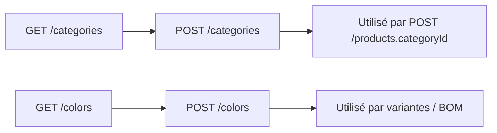

# Flow — Référentiels (catégories & couleurs)

## 1. Analyse produit & enjeux

Sans catégories et couleurs, impossible de créer un produit cohérent (référence auto, variantes coloris). Ce sont les fondations du catalogue atelier.

## 2. User stories

**US-REF-01**  
En tant qu’admin atelier, je veux créer une catégorie (ex. Sac), afin de classer les produits et générer des références (`S/000001`).

**US-REF-02**  
En tant qu’admin atelier, je veux créer une couleur (nom + hex), afin de l’associer aux variantes produit et lignes BOM.

## 3. Critères d’acceptation

```gherkin
Étant donné un utilisateur admin authentifié
Quand il crée une catégorie avec name "Sac" et code "S"
Alors la catégorie est créée avec slug dérivé et refSequenceLength=6 par défaut

Étant donné une catégorie dont le code "S" existe déjà
Quand il tente de recréer une catégorie avec code "S"
Alors l’API renvoie une erreur de conflit / unicité

Étant donné un utilisateur authentifié non admin
Quand il appelle POST /categories
Alors l’API répond 403
```

```gherkin
Étant donné un admin
Quand il crée une couleur { name: "Naturel", hex: "#e8d8b8" }
Alors la couleur est active=true et hex normalisé en majuscules

Étant donné un hex invalide "#fff"
Quand il soumet le formulaire
Alors la validation DTO échoue (format #RRGGBB obligatoire)
```

## 4. Flow API



### Ordre recommandé

1. `GET /categories` / `GET /colors` — peupler les selects  
2. Si manquant → `POST /categories` puis `POST /colors`  
3. Conserver les `id` pour le flow produit

### Endpoints

| Méthode | Path | Auth | Rôle |
|---------|------|------|------|
| `GET` | `/categories` | JWT | lecture |
| `GET` | `/categories/:id` | JWT | lecture |
| `POST` | `/categories` | JWT + Admin | écriture |
| `GET` | `/colors` | JWT | lecture |
| `GET` | `/colors/:id` | JWT | lecture |
| `POST` | `/colors` | JWT + Admin | écriture |

## 5. Types / enums

Pas d’enum Prisma sur Category / Color.

## 6. Brief UI/UX

- Écrans admin « Référentiels » : onglets Catégories / Couleurs.  
- Empty state : « Aucune catégorie — créer la première pour pouvoir ajouter des produits ».  
- Formulaire couleur : color picker + champ hex synchronisé ; preview pastille.  
- Afficher le `code` catégorie à côté du nom (préfixe de ref produit).  
- Erreur 403 : message « Droits administrateur requis ».  
- Erreur unicité : « Ce code / couple nom+hex existe déjà ».

## 7. Brief API

### `POST /categories` — CreateCategoryDto

| Champ | Obligatoire | Contraintes |
|-------|-------------|-------------|
| `name` | oui | string |
| `code` | non | `^[A-Za-z0-9]{1,10}$` → stocké UPPERCASE ; base de la ref produit |
| `slug` | non | sinon dérivé du name |
| `refSequenceLength` | non | 1–12, défaut **6** |

Side effects : `refNextSequence` démarre à 1.

### `POST /colors` — CreateColorDto

| Champ | Obligatoire | Contraintes |
|-------|-------------|-------------|
| `name` | oui | max 80 |
| `hex` | oui | `^#[0-9A-Fa-f]{6}$` |
| `active` | non | défaut `true` |

Unicité : `(name, hex)`.

## 8. MVP vs Post-MVP

| MVP | Post-MVP |
|-----|----------|
| CRUD liste + création catégorie / couleur | Import CSV, archives couleur, historique slug |
