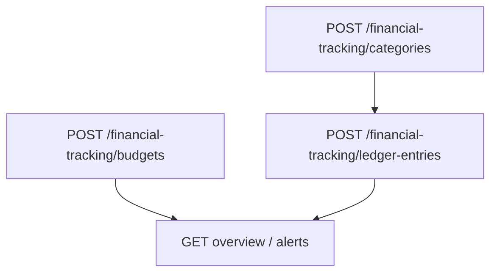

# Flow — Suivi financier

## 1. Analyse produit & enjeux

Le module finance trace catégories d’écritures, écritures ledger (recettes / dépenses / transferts) et budgets. Les paiements factures/achats peuvent aussi créer des écritures — ce flow couvre la création manuelle.

## 2. User stories

**US-FIN-01**  
En tant que responsable financier, je veux créer des catégories ledger, afin de classer les flux.

**US-FIN-02**  
En tant que responsable financier, je veux saisir une écriture, afin d’enregistrer une opération hors automatismes.

**US-FIN-03**  
En tant que responsable financier, je veux définir un budget période, afin de comparer réalisé vs prévu.

## 3. Critères d’acceptation

```gherkin
Étant donné code catégorie unique
Quand je crée une catégorie INCOME|EXPENSE|TRANSFER
Alors code est stocké UPPERCASE, active=true par défaut

Étant donné amount < 0.01
Quand je crée une écriture
Alors validation échoue

Étant donné periodEnd < periodStart
Quand je crée un budget
Alors BadRequest
```

## 4. Flow API



### Ordre recommandé

```
POST /financial-tracking/categories
POST /financial-tracking/ledger-entries   # ledgerCategoryId optionnel
POST /financial-tracking/budgets
GET  /financial-tracking/...              # overview / alerts (déjà docqués)
```

### Endpoints create

| Méthode | Path | Auth |
|---------|------|------|
| `POST` | `/financial-tracking/categories` | JWT + Admin |
| `POST` | `/financial-tracking/ledger-entries` | JWT + Admin |
| `POST` | `/financial-tracking/budgets` | JWT + Admin |

Voir aussi `docs/financial-tracking/` pour overview / alertes.

## 5. Types / enums

| Enum | Valeurs |
|------|---------|
| `LedgerEntryType` | `INCOME`, `EXPENSE`, `TRANSFER` |
| `BudgetDirection` | `INCOME`, `EXPENSE` |

## 6. Brief UI/UX

- Écran admin Finance : onglets Catégories / Écritures / Budgets.  
- Form écriture : type, montant, date, libellé + liaisons optionnelles (client, fournisseur, commande, facture, achat).  
- Empty categories : forcer à créer une catégorie avant d’exiger un classement (mais `ledgerCategoryId` reste optionnel API).  
- Budget : datepicker range ; empêcher fin < début côté UI.  
- Currency : 3 lettres, défaut MGA (affichage ISO). Conversion EUR via `GET /company-settings/convert` et taux `eurToMgaRate`.

## 7. Brief API

### CreateLedgerCategoryDto

| Champ | Obligatoire | Notes |
|-------|-------------|-------|
| `code` | oui | 2–40, → UPPERCASE unique |
| `name` | oui | 2–120 |
| `entryType` | oui | INCOME \| EXPENSE \| TRANSFER |
| `description` | non | |
| `active` | non | défaut true |

### CreateLedgerEntryDto

| Champ | Obligatoire | Notes |
|-------|-------------|-------|
| `entryDate` | oui | ISO |
| `label` | oui | 2–160 |
| `entryType` | oui | |
| `amount` | oui | ≥ 0.01 |
| `currency` | non | 3 chars, défaut EUR |
| `clientId`, `supplierId`, `salesOrderId`, `invoiceId`, `purchaseOrderId`, `ledgerCategoryId`, `notes` | non | FKs Prisma |

### CreateFinancialBudgetDto

| Champ | Obligatoire | Notes |
|-------|-------------|-------|
| `label` | oui | 2–160 |
| `direction` | oui | INCOME \| EXPENSE |
| `amount` | oui | ≥ 0.01 |
| `periodStart`, `periodEnd` | oui | end ≥ start |
| `currency` | non | EUR |
| `ledgerCategoryId`, `clientId`, `supplierId`, `notes` | non | |

## 8. Edge cases

| Cas | Comportement |
|-----|--------------|
| Code catégorie dupliqué | conflit |
| FK invalides | erreur Prisma |
| Montants arrondis en réponse | UI doit accepter Decimal-as-number |

## 9. MVP vs Post-MVP

| MVP | Post-MVP |
|-----|----------|
| CRUD catégories + écritures + budgets | Rapprochement bancaire, exports compta |
