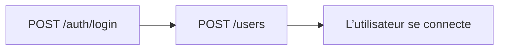

# Flow — Utilisateurs internes

## 1. Analyse produit & enjeux

Les utilisateurs portent le rôle métier et le flag admin. Ils conditionnent `AdminGuard` (écritures) et les notifications ciblées par rôle.

## 2. User stories

**US-USR-01**  
En tant que gérant / admin, je veux créer un utilisateur avec rôle, afin de lui donner accès à l’ERP.

## 3. Critères d’acceptation

```gherkin
Étant donné un email libre et password ≥ 8
Quand je crée un user avec role
Alors le password est hashé (jamais renvoyé) et isAdmin=false par défaut

Étant donné un email déjà utilisé
Quand je crée
Alors Conflict

Étant donné un user non admin / non GERANT
Quand il appelle POST /users
Alors 403
```

## 4. Flow API



### Endpoints

| Méthode | Path | Auth |
|---------|------|------|
| `POST` | `/users` | JWT + Admin (garde classe entière) |
| `GET` | `/users` | JWT + Admin |

Prérequis : session d’un compte déjà admin / gérant.

## 5. Types / enums

| Enum `UserRole` | Usage typique |
|-----------------|---------------|
| `GERANT` | accès admin écritures |
| `RESPONSABLE_GENERAL` | notifs proforma / commandes |
| `RESPONSABLE_PRODUCTION` | atelier |
| `RESPONSABLE_LIVRAISON` | livraisons |
| `RESPONSABLE_FINANCIER_STOCKS` | finance / stocks / notifs SO |

`AdminGuard` : `role === GERANT` **OU** `isAdmin === true`.

## 6. Brief UI/UX

- Form : email, mot de passe (≥ 8), rôle (select), nom optionnel, toggle isAdmin.  
- Empty list : CTA « Inviter un collaborateur ».  
- Ne jamais ré-afficher le mot de passe après create.  
- Erreur conflit email : message clair.

## 7. Brief API — CreateUserDto

| Champ | Obligatoire | Notes |
|-------|-------------|-------|
| `email` | oui | email, lowercased |
| `password` | oui | min 8 |
| `role` | oui | UserRole |
| `name` | non | max 120 |
| `isAdmin` | non | défaut `false` |

Side effects : `bcrypt.hash(password, 10)` → `passwordHash`.

## 8. Edge cases

| Cas | Comportement |
|-----|--------------|
| Email duplicate | Conflict |
| Role invalide | validation DTO |
| Dernier admin désactivé | hors scope create — à traiter en update/delete |

## 9. MVP vs Post-MVP

| MVP | Post-MVP |
|-----|----------|
| Create user + rôle | Invite email, reset password, 2FA |
